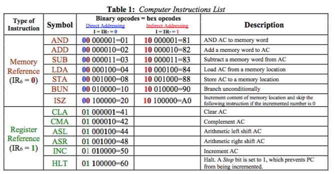

# Basic Computer

This python program simulates a basic computer with a simple instruction set.

# How to Use

Modify the instruction codes located in the memory addresses in the "program.txt" file.

The program starts at address 0x00 and executes each instruction.

When you have written a program in the "program.txt" file run the computer with the terminal command "python3 computer.py"

The computer will execute your program and generate an "output.txt" file with the final memory state of the program.

# Instructions

The computer accepts the following instruction set.

# note

This computer simulation was developed for use as a tool to help me write programs for a basic computer designed in CEG 2136 Computer Architecture

# demo

A demo programs are provided "sequence.txt" adds a series of numbers until the current sum is zero at which point the program logs the last values added to a location in memory and terminates. "multiply.txt" multiplies two numbers and stores the result 
